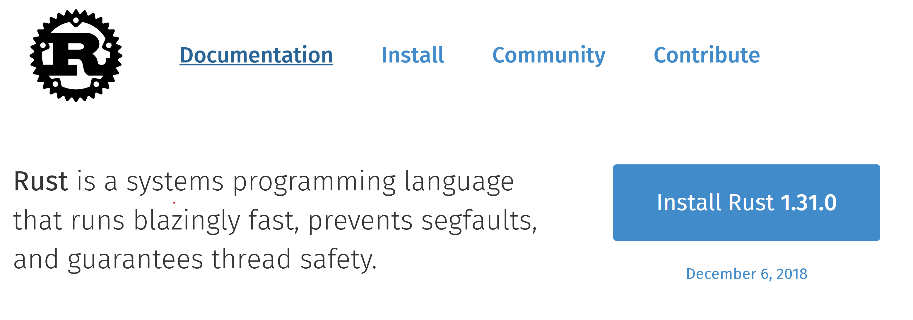
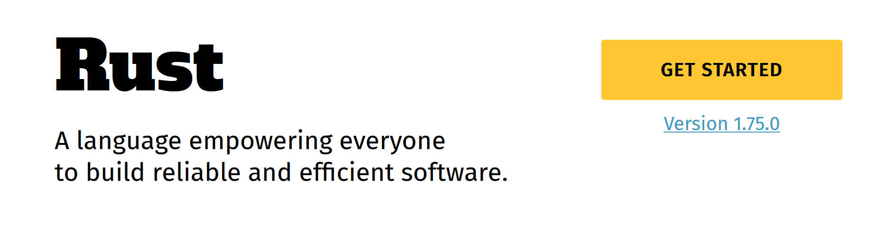
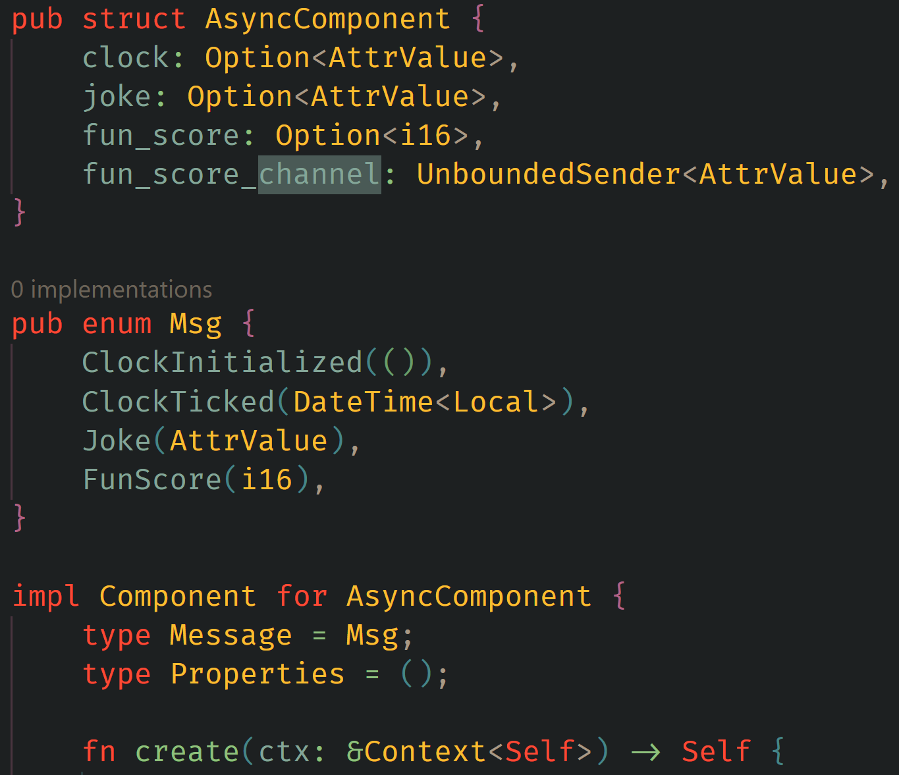

<!--
paginate: true
 -->
<!-- 
_footer: ''
_paginate: false
 -->

<!-- _class: lead -->


# What do you even mean<br>"Empowering Everyone"?!

<br>

### Or: Give Embedded A Chance

---

## Ye' Olden Days: [prev.rust-lang.org](https://prev.rust-lang.org)



Pre-2019 Rust Website

---

<!-- header: ' ' -->

## What was Pre-2018 Rust Like?

2018 Edition was the first ever edition.

- Parallel Codegen, incremental compilation
- The `try!` operator was superseded by `?`
- The module system was funny (`extern crate ...`)
- `impl Trait`, `NLL`, Clippy
- `async` and `await` not keywords yet!

Occasionally, builds would break.

<!-- _footer: "https://blog.rust-lang.org/2020/05/15/five-years-of-rust.html" -->

---

## `"prevents segfaults"`

- What does it even mean `SEGFAULT`?
  Does the _absence_ of something define a language?!

- "🚀🚀🚀 blazingly fast 🚀🚀🚀" has become a meme
  Don't put this in your project `README.md`

- Guaranteed Thread Safety is also pretty technical

Overall, yes these are a big deal, but this slogan had to evolve.

---

## Current [rust-lang.org](https://rust-lang.org)

<br>



<br>
<br>

Current Rust Language website

---

## "Empowering Everyone"

It's not just some inclusivity statement
(though the community is pretty diverse-friendly).

This is the **long-term goal** (as in, not yet fulfilled).

> Rust will erase the boundary between system and application development

-- Somebody on Reddit

---

### The system vs. application development boundary

Perceived boundary:

- Systems care about
  - rigorous design invariants (thread/memory safety)
  - performance
- Applications tend to care more about:
  - fast development
  - maintainability
  - simplicity

---

## It's mostly a false dichotomy

There is no meaningful distinction (anymore).

Only slightly more interesting:
Are you working on a `lib.rs` or a `main.rs`?

Realistically: both.

---

## Aside: Yew

No boundary, because:
Frontend looks like
System Development!

That's maybe
not the goal.
Or is it?

Not dunking on yew,
it's cool



<!-- _footer: "[async-clock example for yew on github](https://github.com/yewstack/yew/blob/f6b23f08284dec949efaf860fbe8e9198e3d0bed/examples/async_clock/src/main.rs#L17-L35)" -->

---

## If there is no boundary:<br>everybody can do embedded programming

The public "image" of embedded has false admiration/despise.

It's not exactly easy, but can be rewarding!

Recently, it's gotten easier because of two events.

---

## Embedded HAL 1.0 Release (Jan. 9th 2024)

The Hardware Abstraction Layer allows for writing hardware-agnostic drivers.

Previously, the ecosystem was furiously changing. 1.0 was bikeshedded for [4 years](https://github.com/rust-embedded/embedded-hal/blob/master/embedded-hal/CHANGELOG.md#v100-alpha1---2020-06-16).

Now:
[So many drivers](https://crates.io/search?q=category%3Aembedded%20agnostic%20driver&sort=recent-updates)

[So many BSPs](https://crates.io/search?q=category%3Aembedded%20bsp&sort=recent-updates)

<!-- _footer: "https://blog.rust-embedded.org/embedded-hal-v1/" -->

---

## Async on Microcontrollers: [embassy.dev](https://embassy.dev)

Imagine `tokio`, but on microcontrollers.

Why does this make sense? `async` is for I/O, and on a microcontroller EVERYTHING is I/O!
Even the passing of time.

**FINALLY** embassy [is on crates.io](https://embassy.dev/blog/embassy-hals-released/)! (Jan. 22nd 2024)

<style scoped>
img {
    border-radius: 0px;
}
</style>

<br>


---

## Embassy Example

Simple things are simple:

```rust
let mut button = Input::new(p.PIN_16, Pull::None);
loop {
    button.wait_for_high().await;

    info!("Toggle LED");
    led.toggle();

    Timer::after_millis(500).await;
}
```

<!-- _footer: "[Async GPIO example](https://github.com/embassy-rs/embassy/blob/9e704e622abc348d63c061425c9699fbff9ca7d2/examples/rp/src/bin/gpio_async.rs#L29-L39)" -->

---

## Embassy Example 2

Complicated things are possible:

```rust
loop {
    match control.join_wpa2(WIFI_NETWORK, WIFI_PASSWORD).await {
        Ok(_) => break,
        Err(err) => info!("join failed with status={}", err.status),
    }
}
```

<!-- _footer: "[Wifi Server Example](https://github.com/embassy-rs/embassy/blob/9e704e622abc348d63c061425c9699fbff9ca7d2/examples/rp/src/bin/wifi_tcp_server.rs#L94-L102)" -->

---

# Takeaways

- Rust has come a long way
- The "systems" aspects are converging with the "approachability" aspects
- The ecosystem is glorious, but it is bleeding edge
- Embedded programming can be painless and enjoyable.

<br>

## Thanks :) and have fun
